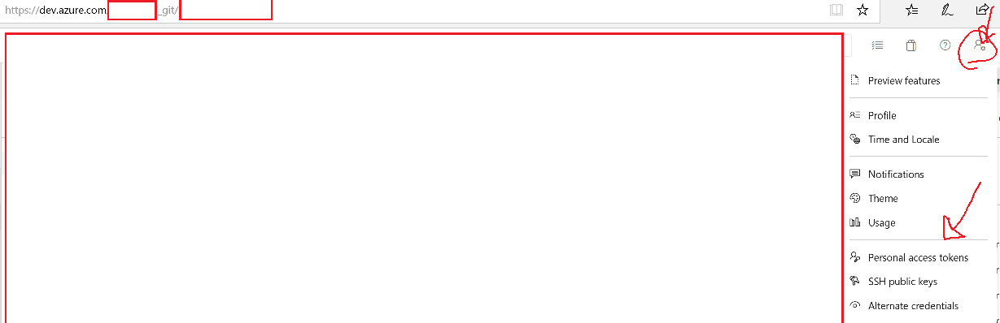
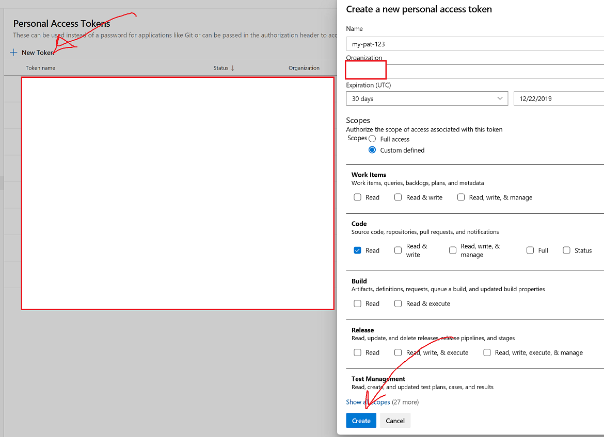
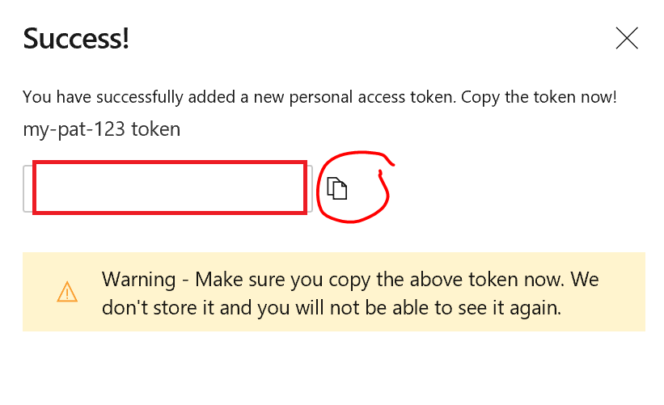
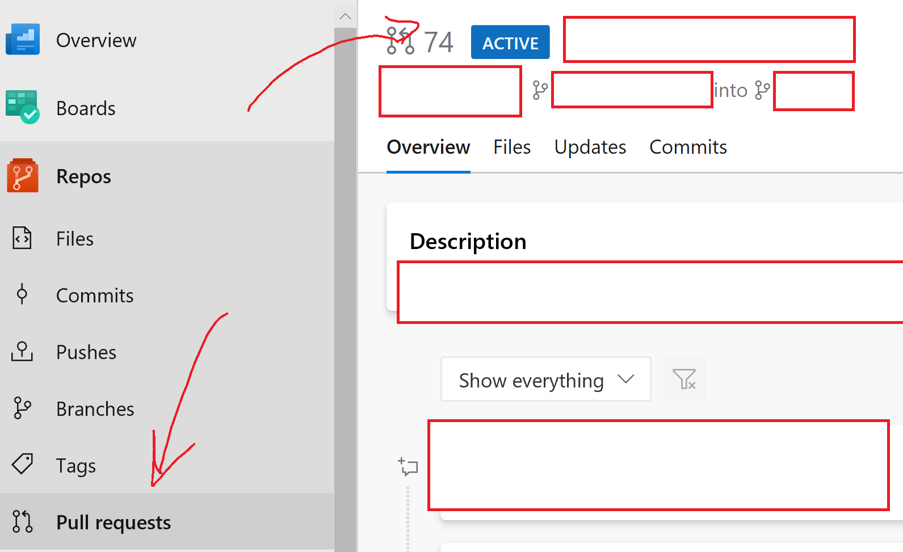

## Azure DevOps REST Calls from PowerShell

We're looking to utilize a Personal Access Token (PAT) in order to query an Azure DevOps repository.

The scope of the PAT will use Code - Read.

### Helpful Links

1. [Authenticate With Personal Access Tokens](https://docs.microsoft.com/en-us/azure/devops/organizations/accounts/use-personal-access-tokens-to-authenticate?view=azure-devops&tabs=preview-page)
1. [Azure DevOps REST API - Get Commits By Date](https://docs.microsoft.com/en-us/rest/api/azure/devops/git/commits/get%20commits?view=azure-devops-rest-5.1#in-a-date-range)
1. [Azure DevOps REST API - Get Commits In Branch](https://docs.microsoft.com/en-us/rest/api/azure/devops/git/commits/get%20commits?view=azure-devops-rest-5.1#on-a-branch)
1. [Azure DevOps REST API - Get Pull Requests Commits](https://docs.microsoft.com/en-us/rest/api/azure/devops/git/pull%20request%20commits/get%20pull%20request%20commits?view=azure-devops-rest-5.1)
1. [Azure DevOps Pipeline Predefined Variables](https://docs.microsoft.com/en-us/azure/devops/pipelines/build/variables?view=azure-devops&tabs=yaml)

### Set up Personal Access Token (PAT)

Assuming that one has access to an Azure DevOps organization, we can navigate user settings to generate a PAT.

We can then create a new token.

> We should allow for Code - Read as the scope, and make sure to point to the appropriate organization. Also, we can set the expiration for the token to something sooner.

We can now copy the token for later use in the rest of the exercise.

> We should keep the token as needed, and we can also regenerate or revoke the token too.

### Test Scenarios

We can update the scripts with the appropriate settings and attempt to run them.

We can utilize the scripts in conjunction with [Azure DevOps Pipeline Predefined Variables](https://docs.microsoft.com/en-us/azure/devops/pipelines/build/variables?view=azure-devops&tabs=yaml) if we'd like to get a list of files that have changed. For instance, we can make use of the System.PullRequest.PullRequestId in an ADO pipeline and feed that into an inline PowerShell task with sample for getting commits by a pull request ID.

#### Get Commits In a Branch By Date

The goal for this is to get the changes in the commits in a given branch, in a specified **date range**.

> We're treating the changes to files as detected in $change.changeType (add, edit, etc.) as all the same change.  We could do additional filtering based on the change type, but for now we're going to bundle together the files.

Please refer to this [Script - Get Commits in Branch by Date](../Scenarios/Scenario-ADO-REST/get-commits-in-branch-by-date.ps1).  We'll want to update the script with the appropriate values for our query before we run the script.

In the sample , we're using the following:

| Name | Description |
| ----------------------------------------- |------------------- |
| $PAT            | Personal Access Token - the token should have code-read rights to the specified Azure DevOps Organization.  Also this should have already expired!
| $AzureDevOpsOrg      | We're using this to form our ADO REST request, for example, "https://dev.azure.com/my-org".  Be sure to encode spaces with '%20'
| $Project | Name of the project.  Be sure to replace spaces with %20. |
| $RepositoryID       | Name of the Azure DevOps Repository.  Be sure to replace spaces with '%20' |
| $branch | Name of the branch in Azure DevOps Repository. Be sure to replace spaces with '%20' | keyvaultobjectnames |
| $pattern       | This will be the pattern to match for the path on changed items in a commit.  We can use "*.ps1" for example, or "/folder*.ps1"|
| $toDate    | This is a date that needs to be formatted 'MM/dd/yyyy%20hh:mm:ss%20tt'.  For example 11/15/2019%2010:00:00%20AM. This date should also be later than the $fromDate.  Check out [Azure DevOps REST API - Get Commits By Date](https://docs.microsoft.com/en-us/rest/api/azure/devops/git/commits/get%20commits?view=azure-devops-rest-5.1#in-a-date-range)|
| $fromDate             | This is a date that needs to be formatted 'MM/dd/yyyy%20hh:mm:ss%20tt'.  For example 11/14/2019%2010:00:00%20AM. This date should also be earlier than the $toDate.  Check out [Azure DevOps REST API - Get Commits By Date](https://docs.microsoft.com/en-us/rest/api/azure/devops/git/commits/get%20commits?view=azure-devops-rest-5.1#in-a-date-range) |

#### Get Commits In a Branch

The goal for this is to get the changes in the commits in a given **branch**.

> We're treating the changes to files as detected in $change.changeType (add, edit, etc.) as all the same change.  We could do additional filtering based on the change type, but for now we're going to bundle together the files.  We're also going to use **gitLogHistoryMode=fullHistory** in the query string to pull down the full history.  If we wanted, we could also constrain the date range using the **searchCriteria.fromDate** and **searchCriteria.toDate** as in the previous example to further filter the commits for a given branch.

Please refer to this [Script - Get Commits in Branch](../Scenarios/Scenario-ADO-REST/get-commits-in-branch.ps1).  We'll want to update the script with the appropriate values for our query before we run the script.

In the sample , we're using the following:

| Name | Description |
| ----------------------------------------- |------------------- |
| $PAT            | Personal Access Token - the token should have code-read rights to the specified Azure DevOps Organization.  Also this should have already expired!
| $AzureDevOpsOrg      | We're using this to form our ADO REST request, for example, "https://dev.azure.com/my-org".  Be sure to encode spaces with '%20'
| $Project | Name of the project.  Be sure to replace spaces with %20. |
| $RepositoryID       | Name of the Azure DevOps Repository.  Be sure to replace spaces with '%20' |
| $branch | Name of the branch in Azure DevOps Repository. Be sure to replace spaces with '%20' | keyvaultobjectnames |
| $pattern       | This will be the pattern to match for the path on changed items in a commit.  We can use "*.ps1" for example, or "/folder*.ps1"|

#### Get Commits In a Pull Request

The goal for this is to get the changes in the commits associated with a **pull request** in a given branch.

> We're treating the changes to files as detected in $change.changeType (add, edit, etc.) as all the same change.  We could do additional filtering based on the change type, but for now we're going to bundle together the files.

Please refer to this [Script - Get Commits in Pull Request](../Scenarios/Scenario-ADO-REST/get-commits-in-pull-request.ps1).  We'll want to update the script with the appropriate values for our query before we run the script.

In the sample , we're using the following:

| Name | Description |
| ----------------------------------------- |------------------- |
| $PAT            | Personal Access Token - the token should have code-read rights to the specified Azure DevOps Organization.  Also this should have already expired!
| $AzureDevOpsOrg      | We're using this to form our ADO REST request, for example, "https://dev.azure.com/my-org".  Be sure to encode spaces with '%20'
| $Project | Name of the project.  Be sure to replace spaces with %20. |
| $RepositoryID       | Name of the Azure DevOps Repository.  Be sure to replace spaces with '%20' |
| $branch | Name of the branch in Azure DevOps Repository. Be sure to replace spaces with '%20' | keyvaultobjectnames |
| $pattern       | This will be the pattern to match for the path on changed items in a commit.  We can use "*.ps1" for example, or "/folder*.ps1"|
| $pullRequestId       | This will be the pull request ID as referred to by ADO. |

The Pull Request ID can be pulled in from different ways.  In this case, we can refer to an active Pull Request in ADO.

We could also pull it in from an Azure DevOps pipeline using [Azure DevOps Pipeline Predefined Variables](https://docs.microsoft.com/en-us/azure/devops/pipelines/build/variables?view=azure-devops&tabs=yaml).